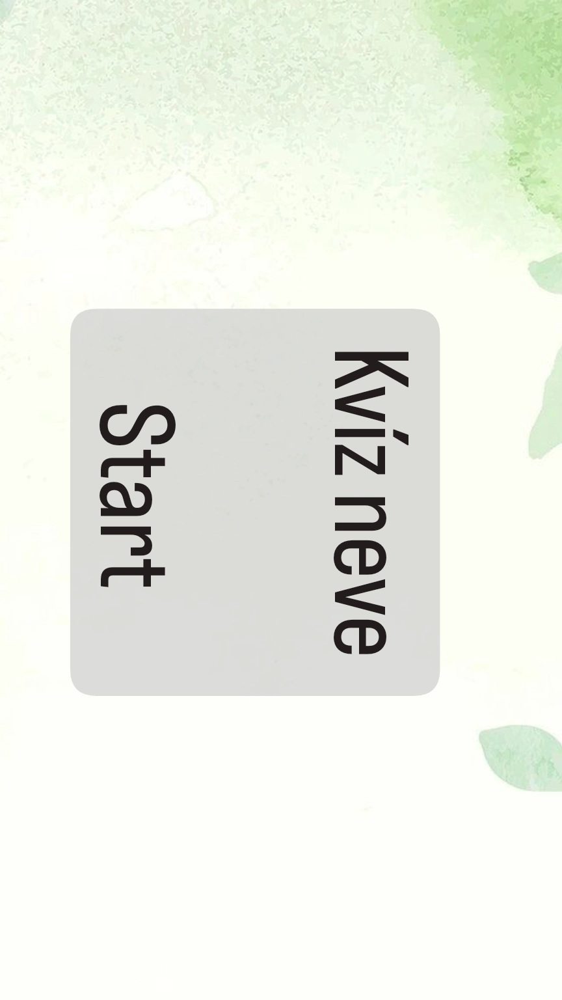
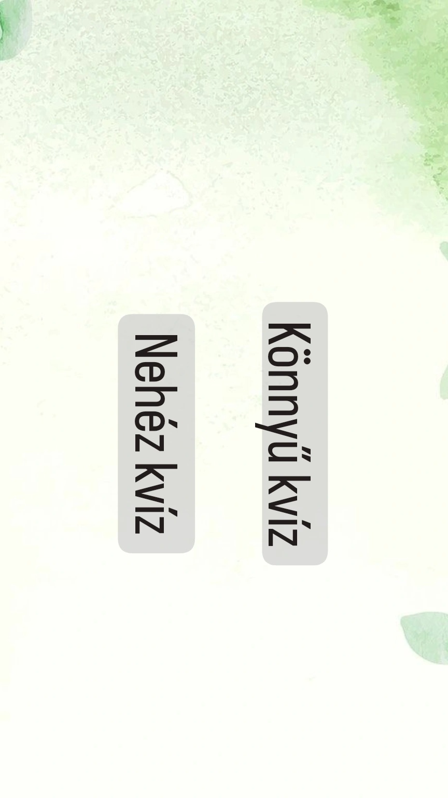
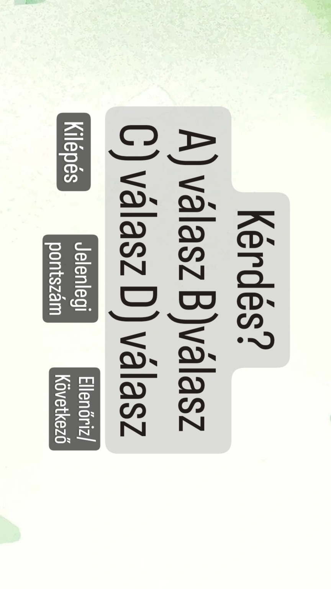
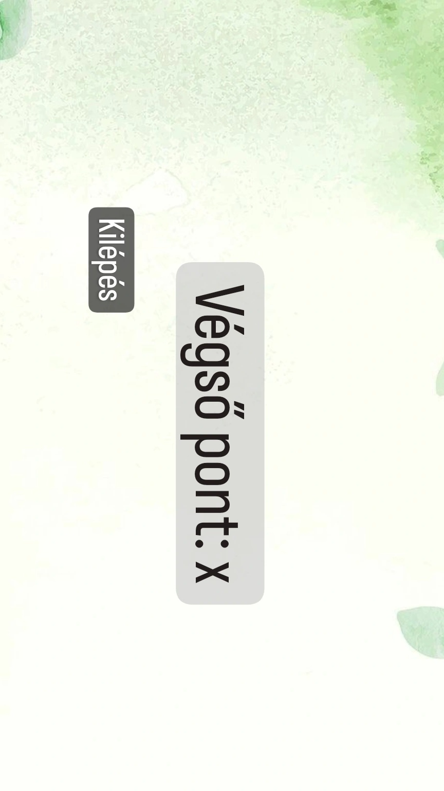

# Funkcionális specifikáció

## 1. Jelenlegi helyzet leírása
A hagyományos módon tanított európai országok, illetve azok fővárosát kevesen tudják, illetve a tapasztalatok alapján nem érzik fontosnak a diákok ezek megtanulását. Sok próbálkozás van arra, hogy érdekesebbé tegyék az oktatást, így manapság sűrűn előfordul, hogy a tananyagot online formátumban, valamilyen nem szokványos módon adják le.

## 2. A rendszer célja és nem célja

### A rendszer céljai:
- Olyan felület, amely könnyen kezelhető
- Azonnali visszajelzés a jelenlegi tudásról
- Lehetőség az országok listához adására, majd a listában szereplő országok fővárosai lesznek a kvízben

### Nem céljai:
- Térképen elhelyezni az adott országot
- Fővárost elhelyezni az adott országban
- Fővárosokról egyéb információt közölni

## 3. Vágyálomrendszer leírása
Vágyunk, hogy a rendszerünk ingyenesen elérhető, jól átlátható és kezelhető legyen, illetve nem utolsó sorban gyakorlati segítséget nyújtson. A felhasználók amellett, hogy jól szórakoznak meg tanulhatnak is. Lehetőség van személyre szabott kérdések megválaszolására is. Reméljük, hogy sok felhasználó fog tanulni a rendszer használata során.

## 4. Jelenlegi üzleti folyamatok modellje
4.1. A mai technológiai fejlődés olyan gyors, hogy az oktatási rendszer nehézkesen tud lépést tartani vele. A diákoknak kevésbé vonzó a hagyományos tanulási módszer, és inkább a mobiltelefonjaikat preferálják. Jelenleg még mindig a tankönyvekből tanulnak, és papíralapú dolgozatokat készítenek, ami nem csak elavultnak tűnik, de nem is környezetbarát, emellett az oktatóknak rengeteg idejüket emészti fel az egyenkénti javítás. Az általunk fejlesztett online platform elsődlegesen a földrajz tantárgyban kínál megoldást erre a problémára.

4.2. **Összesítés:**

4.2.1. Számonkérés: papíron, füzetbe vagy szóban.

4.2.2. Javítás: Oktatóknak egyesével kézzel való javítása szükséges.

4.2.3. Elavult, időigényes.

## 5. Igényelt üzleti folyamatok leírása
Az általunk fejlesztett online platformnak óriási előnyei lesznek mind a diákok, mind a tanárok számára. A diákok élvezetes, izgalmas órákat fognak eltölteni, illetve a tanároknak sem kell többé a manuális javítással foglalkozniuk. Azonnali visszajelzést kapnak a diákoktól az elért pontszámról, és hibás válaszok esetén az is azonnal kiderül, hogy mi lett volna a helyes válasz.

A felületen könnyen lehet navigálni, illetve könnyű használni azt. A felület letisztult minimál dizájnra épül. A felhasználó kiválasztja, hogy mennyi kérdést szeretne kapni, majd elindul a játék. A játék véletlenszerűen teszi fel a kérdéseket, pontosan annyit, amennyit a felhasználó megadott kezdéskor. Válaszol a kérdésre, és azonnali visszajelzést kap, hogy a válasz helyes volt e vagy sem. A végén egy teljes értékelés történik, azaz, hogy mennyit sikerült eltalálnia mennyiből.

4.2. **Összesítés:**

4.2.1. Számonkérés: Online, a rendszert használva.

4.2.2. Javítás: Teljesen a rendszer végzi.

4.2.3. Modern, egyszerű.

## 6. Követelménylista
| Követelmény | Leírás                                                           |
|------------|------------------------------------------------------------------|
| K1         | Start gomb megnyomásával elindul a játék.                        |
| K2         | Megjelenik a kérdés.                                             |
| K3         | Megjelenik a hozzákapcsolódó 4 válaszlehetőség is.                |
| K4         | Kiderül melyik volt a helyes, illetve melyek a helytelen válaszok. |
| K5         | Lépés a következő kérdésre.                                       |
| K6         | Eredmények összegzése.                                            |
| K7         | Játék újraindítása.                                               |

## 7. Használati esetek
- **Aktorok:** A diákok.

  	 - **A felhasználó által elvégezhető műveletek**:

        -  Két nehézségi fokozat közül lehet majd választani.

  	         - Könnyű fokozat választása esetén 5,
  	         - Nehéz fokozat választása esetén pedig 10 kérdésre kell a felhasználónak választ adni.

  	    - A felhasználó 4 válaszlehetőség közül fog tudni választani.
  	    - Ha a felhasználó befejezte a kérdéssort,  megtekintheti a pontjait.

## 8. Képernyőtervek
- Kezdő felület a Start gombbal
  
- Eldöntheti a felhasználó milyen kvízt szeretne játszani -> könnyű vagy nehéz
- Kérdések-válaszok megjelenítése az alábbi módon
- Pontszámok összesítése

## 9. Funkció - követelmény megfeleltetés

* Könnyen üzelmetethető lesz mivel nem fog sok helyet / erőforrást felhasználni a programunk futáskor. Külső adatbázisra sincs szükség mivel helyben fog futni az egész.
* Könnyen és akadálymentesen lehet majd használni a weboldalt a grafikus felület álltal, egyértelmű és gördülékeny. 
* A dizájn reszponzív lesz mivel, alkalmazkodik majd a kijelző méretéhez. 
* A program adattárolása helyileg az eszközön fog történni, és nem a felhőbe. Ezzel biztonságosabbá téve a lopástól, és a nemkívánt személyek beletekitésétől.
* Könnyen üzelmetethető lesz mivel nem fog sok helyet / erőforrást felhasználni a programunk futáskor. Külső adatbázisra sincs szükség mivel helyben fog futni az egész.
* Könnyen és akadálymentesen lehet majd használni az appot a grafikus felület álltal, egyértelmű és gördülékeny. 
* A dizájn reszponzív lesz mivel, alkalmazkodik majd a kijelző méretéhez. 
* A program adattárolása helyileg az eszközön fog történni, és nem a felhőbe. Ezzel biztonságosabbá téve a lopástól, és a nemkívánt személyek beletekitésétől. 
* Az adat könnyen mozgatható lesz, mivel helyileg tárolt fájl lesz amit könnyü, exportálni és importálni más eszközökre is akár ha úgyszeretnénk.

## 10. Fogalomszótár
>*Platform:* Egy program futtatásához szükséges hardver és/vagy szoftver környezet.

>*Aktor:* A szereplők vagy felhasználók (angolul: actor) a funkciókat használó emberek és egyéb informatikai rendszerek.

>*Reszponzív:* Folyamatos növelés, tehát attól függően, hogy milyen eszköz, illetve sávszélesség áll rendelkezésre, más és más megjelenítéssel áll elő ugyanaz a tartalom.
