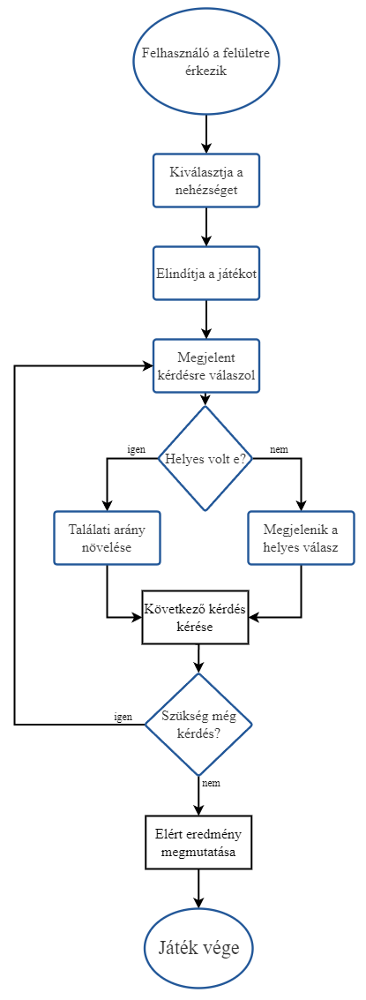

# Rendszerterv

## A rendszer célja
A rendszer fő célja, hogy a diákok könnyebben tanulják meg az európai országokat, illetve azok fővárosát. A rendszer további céljai közt szerepel az is, hogy az oktatók számára megkönnyítse a számonkérést. Illetve nem utolsó sorban egy remek szórakozást nyújt bárki számára amellett, hogy közben tanul is az illető.
## Projektterv

### Projekt szerepkörök
| Név       | Szerepkör |
|-------------|-----------|
| Halász Kata | Programozó |
| Rózsa Kitti | Programozó |
| Tolvaj Péter | Programozó |
| Kovács Dávid  | Programozó |

### Ütemterv

| Feladat | Határidő |
|---------|----------|
| Json file feltöltése adatokkal | 2023. 09. 22 |
| A program üzleti folyamatának pontos leírása | 2023. 09. 22 |
| A program üzleti folyamatok programozása | 2023. 09. 24 |
| A program kinézetének megvalósítása | 2023. 09. 24 |

### Mérföldkövek

## Üzleti folyamatok modellje
### Üzleti szereplők: 
 **_1.)_ Felhasználók**
  Ők azok, akik a kvízjátékot használják, tehát a kérdésekre válaszolnak, valamint a fő résztvevői az alkalmazásnak. Lehetnek gyerekek, felnőttek, oktatók vagy bárki, aki tesztelni szeretné tudását egy földrajzi kvíz kitöltésével.

 **_2.)_ Kérdési adatbázis szolgáltató (JSON fájl):**
  A kérdési adatbázis szolgáltató egy adatforrás, amely a kvízjáték számára biztosítja a kérdéseket. Jelen esetben egy JSON fájl formájában található. Ez a fájl tartalmazza a különböző kérdéseket, valamint a hozzájuk tartozó helyes és helytelen válaszokat. A kvízjáték ezen adatforrás alapján működik, és ezen keresztül jeleníti meg a felhasználóknak a kérdéseket. Ez a folyamat biztosítja, hogy a felhasználók mindig friss, változatos és helyes válaszokat találjanak a kvíz során. Ha a kérdések frissítése vagy változtatása szükséges, akkor ezt a JSON fájlt lehet módosítani, így a változások azonnal érvénybe lépnek a kvízjátékban.

  ### Üzleti folyamatok:
**_1.)_** A felhasználó a Start gombra kattint.

**_2.)_** A játék indítása után eldöntheti, hogy könnyű vagy nehéz módban szeretné a kvízt kitölteni, ami pedig a kérdések számától függ, hiszen a könnyű 5 kérdést jelent, a nehéz pedig 10-et.

**_3.)_** Ezután betöltődnek a kérdések a JSON fájlból, ami véletlenszerűen történik.

**_4.)_** A felhasználó kijelöl egy választ és megjelenik az ellenőrző gomb, amivel értelemszerűen leellenőrizheti válaszának helyességét. Ha jól válaszol +1 pont, ha nem akkor marad az addig megszerzett pontjainak száma, illetve láthatja mi lett volna a helyes válasz. 

**_5.)_** Ezt követően megjelenik a következő gomb, ami egyértelműen azt jelenti, hogy a felhasználó továbbléphet a következő kérdésre. Illetve elérhető lesz egy olyan gomb is, amivel vissza tud lépni a Start-ra a felhasználó. 

**_6.)_** Az eredmények pedig a játék befejeztével kiértékelődnek majd, ami a könnyű kvíznél elért pontszám/5, a nehéz kvíznél pedig elért pontszám/10.

## Követelmények

### Funkcionális követelmények
-Kérdések, válaszok tárolása JSON fájlban.
-Megfelelő működés webes eszközön.
-Felhasználóbarát, könnyen értelmezhető felület kialakítása.
-Helyes, helytelen válaszok megjelenítése.

### Nem funkcionális követelmények
-Nem regisztrációhoz kötött a használata, ezáltal nem tárolja el az eredményeket.

### Törvényi előírások, szabványok

## Funkcionális terv

### Felhasználónak:
- a felhasználó a Start gomb megnyomásával elindítja a játékot
-értelemszerűen lépked kérdésről-kérdésre
- a játék végén látni fogja helyes pontszámát

### Webalkalmazásnak:
- böngészőből elérhetőnek kell lennie
- frontend megírása: HTML, CSS, JavaScript használatával készül
- backend megírása: JavaScript használatával készül
- az adatok tárolására JSON használata

## Fizikai környezet
- A rendszer Javascript nyelven fog íródni (természetesen HTML, CSS segítségével)
- A rendszer asztali számítógépekre készül jelenleg
- Használható Windows, Linux és MacOS rendszeren is használható
- Bármely ismert asztali számítógépen is futó böngészőre van szükség (Google Chrome, Firefox...)
- Fejlesztői eszközök:
  - Visual Studio Code
  - Visual Studio
  - Node.JS
  - Github
 
## Adatbázis terv
Jelenleg a rendszer mögött nem található valódi adatbázis, hiszen az adatokat Json file-ból fogjuk használni, illetve abban fogjuk tárolni a szükséges adatokat.

## Implementációs terv

## Tesztterv
Két fajta tesztet fogunk megkülönböztetni: 
- Egységteszt:
  - Ezzel szükséges lefedni az üzleti logikát (ezzel biztosítva, hogy a kód az elvárt modon működik)
- Kézi tesztelés:
  - Ide tartozik a frontend tesztelése (megnézve, hogy azok szerepelnek a felületen amit akarunk, és úgy ahogy elvárjuk)
  - Felhasználói élmény figyelése (Ha már a fejlesztő/tesztelő nem találja komfortosnak a felületet használva, akkor a felhasználó végképp nem fogja)

## Telepítési terv
Nincs szükség külön telepítő csomagokra, hiszen az alkalmazás webes rendszeren fut. Alkalmazás "telepítési" folyamata: A link birtokában megnyitható a böngészőben.

## Karbantartási terv
ELsősorban a visszajelzésekre támaszkodva fogjuk karbantartani a rendszert. Nem csak az esetleges hibák javítását fogjuk végezni, de az olyan fejlesztési ötleteket is megvalósítjuk, amelyek javítják a felhasználói élményt.
